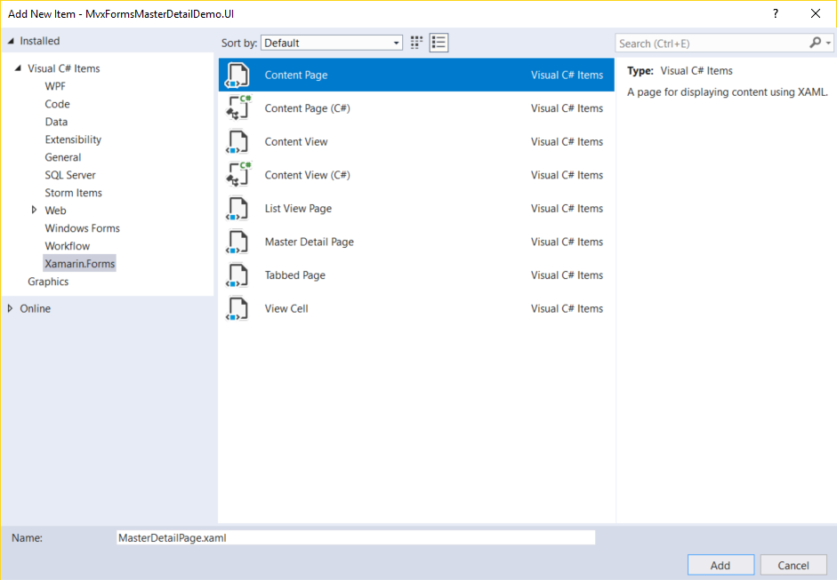

### Creating the XAML file

Xamarin.Forms provides us with some navigation modes including Hierarchical Navigation, Tabbedpage, MasterDetailPage and Modal Pages, etc. For our requirements, we want to have a hamburger menu on the main page. So we can use MasterDetailPage, which is a root page of the application and contains two areas: the left one is the MasterPage, the right one is the DetailPage. We can place the menu in the MasterPage. When clicking the menu item, the navigation service will show another page in DetailPage area.

In MvvmCross, there are some corresponding `MvxFromsPagePresenter` for different page types in Xamarin.Forms, which define how a view will be displayed. We use `MvxPagePresentationAttribute` to specify different page types. For more details, please view the documentation here: [Xamarin.Forms View Presenter](https://www.mvvmcross.com/documentation/platform/xamarin.forms/xamarin-forms-view-presenter).  

Open the `App.cs` file in the MvxFormsMasterDetailDemo.Core project. Notice that the framework will start `HomeViewModel` as the first page. Now let us create a `MasterDetailPage` and use it to replace the first page.

Right click the Pages folder in the MvxFormsMasterDetailDemo.UI project and select `Add`-`New Item`. Select `Content Page` from Xamarin.Forms category, like this:



Open the `MasterDetailPage.xaml` file. Notice that this page is a `ContentPage`. We need to change it to inherit from `MvxMasterDetailPage`.  Replace the XAML code with the following code:

```xaml
<?xml version="1.0" encoding="utf-8" ?>
<views:MvxMasterDetailPage xmlns="http://xamarin.com/schemas/2014/forms"
             xmlns:x="http://schemas.microsoft.com/winfx/2009/xaml"
             x:Class="MvxFormsMasterDetailDemo.UI.Pages.MasterDetailPage"
             xmlns:views="clr-namespace:MvvmCross.Forms.Views;assembly=MvvmCross.Forms"
             xmlns:viewModels="clr-namespace:MvxFormsMasterDetailDemo.Core.ViewModels;assembly=MvxFormsMasterDetailDemo.Core"
             x:TypeArguments="viewModels:MasterDetailViewModel">
</views:MvxMasterDetailPage>
```

We use `MvxMasterDetailPage`  to replace the default `ContentPage` type. To do this, we need to add this code:

`xmlns:views="clr-namespace:MvvmCross.Forms.Views;assembly=MvvmCross.Forms"`

To set the ViewModel of the MasterDetailPage, we need to specify the `x:TypeArguments` with the value `viewModels:MasterDetailViewModel`. Do not forget to import the `viewModels` namespace by adding `xmlns:viewModels="clr-namespace:MvxFormsMasterDetailDemo.Core.ViewModels;assembly=MvxFormsMasterDetailDemo.Core"`.

Open the `MasterDetailPage.xaml.cs` file, replace the base class of it from `ContentPage` to `MvxMasterDetailPage<MasterDetailViewModel>`. Add the `MvxMasterDetailPagePresentation` attribute to the class, as the following code:

```c#
using MvvmCross.Forms.Presenters.Attributes;
using MvvmCross.Forms.Views;
using MvxFormsMasterDetailDemo.Core.ViewModels;
using Xamarin.Forms.Xaml;

namespace MvxFormsMasterDetailDemo.UI.Pages
{
    [XamlCompilation(XamlCompilationOptions.Compile)]
    [MvxMasterDetailPagePresentation(Position = MasterDetailPosition.Root, WrapInNavigationPage = false, Title = "MasterDetail Page")]
    public partial class MasterDetailPage : MvxMasterDetailPage<MasterDetailViewModel>
    {
        public MasterDetailPage()
        {
            InitializeComponent();
        }
    }
}

```

Let's take a look at the `MvxMasterDetailPagePresentation` attribute. There are some very important properties of `MvxMasterDetailPagePresentation`. `Position` is an enum value that is used to indicate the type of the page, which is `Root` here. Please set the other properties as shown, otherwise, you might get some odd results.