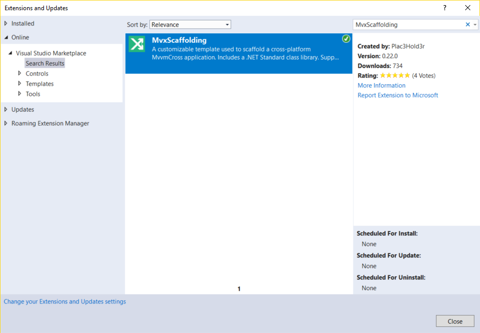
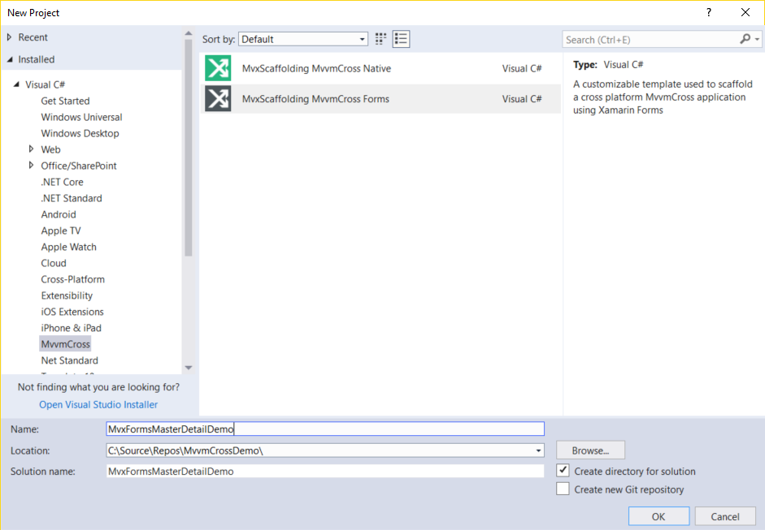
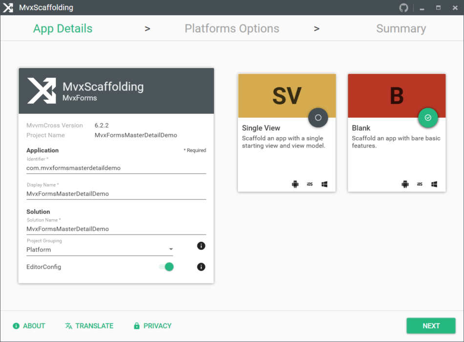
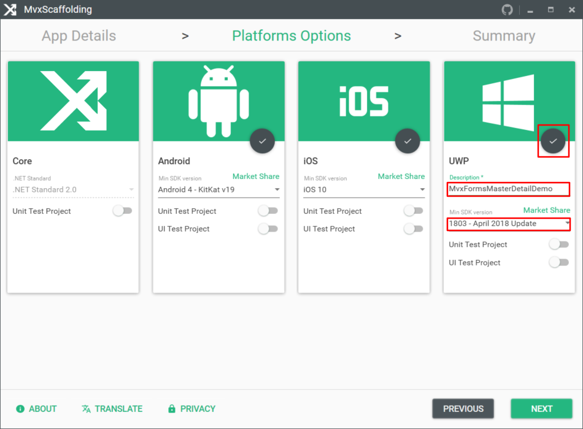

## Creating the project by MvxScaffolding

If you are new for MvvmCross, it might be a little bit tricky to create a Xamarin application with MvvmCross. Fortunately, we have some project templates to simplify our work. You can find them on the official documentation here: [MvvmCross getting-started](https://www.mvvmcross.com/documentation/getting-started/getting-started). I recommend you to use this one: [MvxScaffolding](https://github.com/Plac3hold3r/MvxScaffolding) It is new and supports .net standard. You can search it by clicking Tools-Extensions and Updates in your VS 2017, like this:

After installing it, you can create a new Xamarin.Forms application in MvvmCross category:

Input `MvxFormsMasterDetailDemo` as the project name. The MvxScaffolding provides us with a very friendly interface to customize the application. For a better understanding, we choose Blank template, as shown below:

The default setting doesn't contain UWP project. Select it if you need to support UWP platform, and select the Min SDK version as 1803. It is recommended at the moment since some new futures are not supported in the old Windows 10 versions. Also, you need to input the Description as the UWP application name.

Click the `NEXT` button and You will see a summary window. Check all the information, then click `DONE` button. The MvxScaffolding will generate a basic blank Xamarin.Forms application with a good structure.