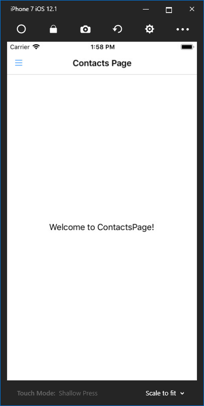

### Adding the hamburger icon for iOS

According to the official documentation of MasterDetailPage, I think iOS should also show a button like Android and UWP, but actually not. We can set an `Icon` property for the MasterPage.

Download the image file [here](https://github.com/yanxiaodi/MvvmCrossDemo/blob/master/MvxFormsMasterDetailDemo/src/MvxFormsMasterDetailDemo.iOS/Resources/hamburger.png). Paste it into the `Resources`  folder of the MvxFormsMasterDetailDemo.iOS project. If there is no such folder, create one. The `Build Action` property of the image should be `BundleResource`.

Open the `MenuPage.xaml` file in the `Pages` folder of the MvxFormsMasterDetailApp.UI project. Add the following code into the `views:MvxContentPage` section: `Icon="hamburger.png"`. Now launch the app for iOS:

That is good!