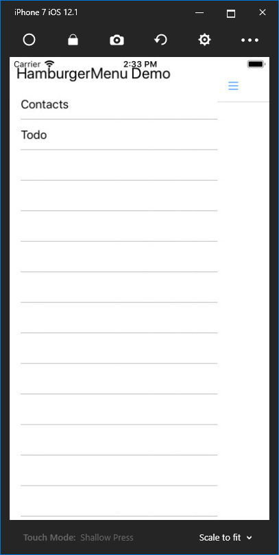
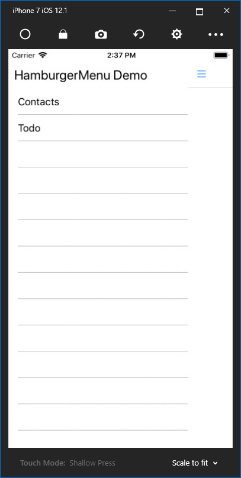
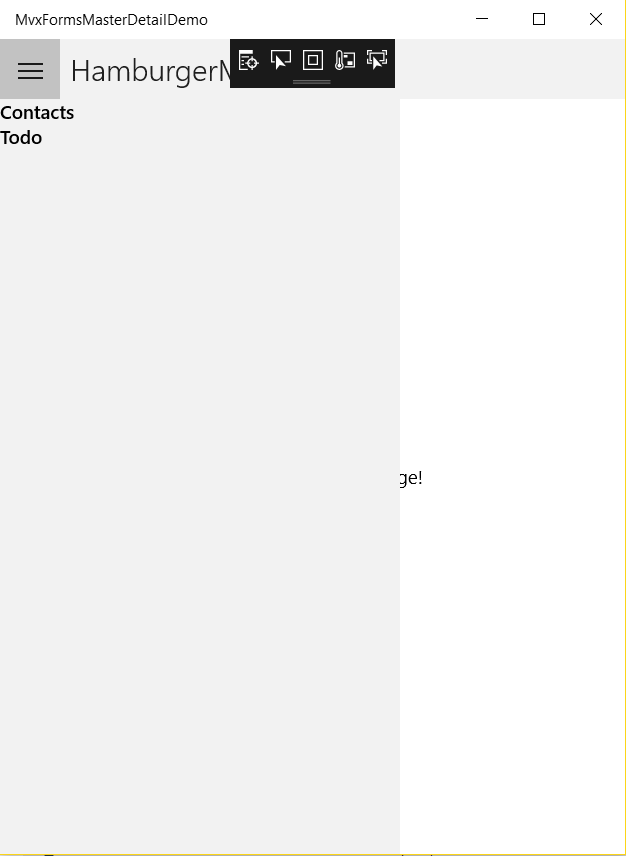

### Adding the header bar for Android and iOS

UWP will add a default header bar for the MasterPage. For Android and iOS, we need to define it respectively.

To provide some specific values for different platforms, we can use the `Device` class, which contains a number of properties and methods that can help us to customize the layout and the functionality for specific-platforms. You can read details about it here: [Xamarin.Forms Device Class](https://docs.microsoft.com/en-us/xamarin/xamarin-forms/platform/device).

For our requirement, we only need to add the header bar for Android and iOS. Open the `MenuPage.xaml` file in `Pages` folder of MvxFormsMasterDetailDemo.UI project. Add the following code before the `ListView` definition:

```xaml
<StackLayout HeightRequest="40">
    <StackLayout.IsVisible>
        <OnPlatform x:TypeArguments="x:Boolean">
            <On Platform="Android, iOS" Value="True" />
            <On Platform="UWP" Value="False" />
        </OnPlatform>
    </StackLayout.IsVisible>
    <Label Text="My HamburgerMenu Demo" Margin="10" VerticalOptions="Center" FontSize="Large"></Label>
</StackLayout>
```

Actually, the `OnPlatform` markup is doing something that likes creating a `switch` statement in the code. It contains several `On` classes to receive the `Platform` properties, which indicate the current platform. There are some different values to identify different platforms: `iOS`, `Android`, `UWP` and `macOS`. So we can create a `StackLayout`,  which contains a `Label` control to show the app name, for Android and iOS by setting its `IsVisible` property. But for UWP, it is invisible. That means adding the code will not make any changes for UWP.

Run the app for Android and iOS. It works fine for Android. But on iOS platform, the header bar slightly overlays the status bar of the phone, as shown below:



We can add some margin for the `StackLayout`. Add another `OnPlatform` markup for iOS, like this:

```xaml
<StackLayout.Margin>
    <OnPlatform x:TypeArguments="Thickness">
        <On Platform="iOS" Value="0,20,0,0" />
    </OnPlatform>
</StackLayout.Margin>
```

It only impacts the UI for iOS. Now take a look for all platforms:

iOS:



Android:


UWP:



Ok, everything is good, except the item height of UWP...