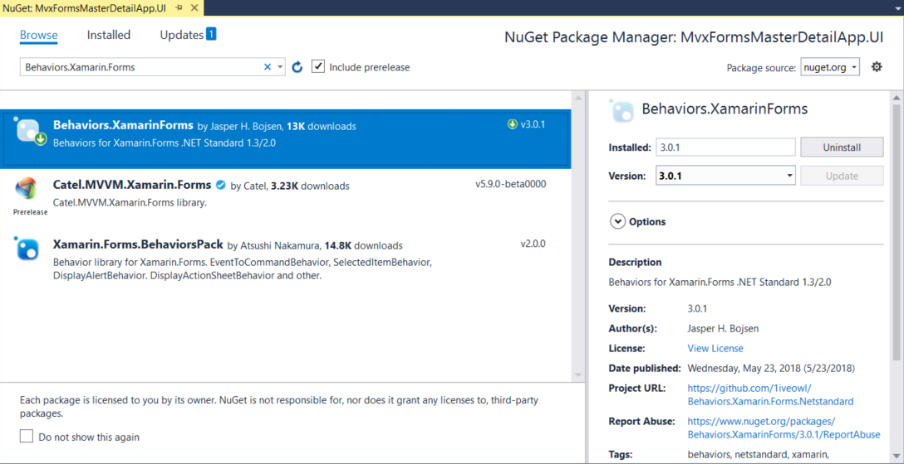

### The other approaches to set the data-binding

#### Using the inherent Command of TextCell

The data-binding mechanism of XAML world is flexible. Actually, we have more than one way to achieve our goal. For example, if you only use `TextCell` to show the menu item, there is a simple way to do the navigation. As I said in the previous section, `TextCell` supports `ICommand` inherently. So we can use the data-binding syntax like this:

```xaml
<DataTemplate>
	<TextCell Text="{Binding}" Command="{Binding BindingContext.DataContext.ShowDetailPageAsyncCommand, Source={x:Reference MainContent}}" CommandParameter="{Binding}"></TextCell>
</DataTemplate>
```

This way is easier. When the user taps the `TextCell`, it will trigger the `Command`. But the disadvantage is that you cannot customize the UI of the menu item. `TextCell` only supports the text. If you would like to add some images or define a complex item layout, you must use `ViewCell`.

#### Using Bahaviors

Also, you might think we can use `ItemSelected`or `ItemTapped` events. Definitely, we can! But unfortunately, these events do not implement `ICommand` interface, so we cannot use the data-binding directly. To use the `ICommand` binding, we need to use a `Behavior` to convert an event to a command, which is described here: [Reusable EventToCommandBehavior](https://docs.microsoft.com/en-us/xamarin/xamarin-forms/app-fundamentals/behaviors/reusable/event-to-command-behavior).

You might be not familiar with Behaviors. Behavior comes from Blend SDK, which is a very useful library in XAML world. The behaviors can be attached to some controls and listen to some events, then invoke some commands in the ViewModel. It is a good way to add the support for `Command` pattern for those controls that were not designed to interact with commands. So we can use MVVM pattern gracefully, instead of using event handlers in the code-behind files.

You can follow the instructions in the official documentation to create your `EventToCommandBehavior`, but we can leverage a third-party library to do it quickly: [Behaviors.Xamarin.Forms.Netstandard](https://github.com/1iveowl/Behaviors.Xamarin.Forms.Netstandard). It is not the official project, but is easy to use. You can install it to the MvxFormsMasterDetailApp.UI project by searching `Behaviors.Xamarin.Forms` through the NuGet Package Manager:



We can use this library to enable the `ListView` control to trigger our command in the ViewModel when selecting the item. To do this, add a bindable property called `SelectedMenuItem` in the `MenuViewModel.cs` file, which is used to indicate the current selected item, like this:

```c#
#region SelectedMenuItem;
private string _selectedMenuItem;
public string SelectedMenuItem
{
    get => _selectedMenuItem;
    set => SetProperty(ref _selectedMenuItem, value);
}
#endregion

```

Replace the `ShowDetailPageAsyncCommand` region we created in the previous section by the code shown below:

```c#
        #region ShowDetailPageAsyncCommand;
        private IMvxAsyncCommand _showDetailPageAsyncCommand;
        public IMvxAsyncCommand ShowDetailPageAsyncCommand
        {
            get
            {
                _showDetailPageAsyncCommand = _showDetailPageAsyncCommand ?? new MvxAsyncCommand(ShowDetailPageAsync);
                return _showDetailPageAsyncCommand;
            }
        }
        private async Task ShowDetailPageAsync()
        {
            // Implement your logic here.
            switch (SelectedMenuItem)
            {
                case "Contacts":
                    await _navigationService.Navigate<ContactsViewModel>();
                    break;
                case "Todo":
                    await _navigationService.Navigate<TodoViewModel>();
                    break;
                default:
                    break;
            }
            if (Application.Current.MainPage is MasterDetailPage masterDetailPage)
            {
                masterDetailPage.IsPresented = false;
            }
            else if (Application.Current.MainPage is NavigationPage navigationPage
                     && navigationPage.CurrentPage is MasterDetailPage nestedMasterDetail)
            {
                nestedMasterDetail.IsPresented = false;
            }
        }
        #endregion

```

Did you find the difference? I removed the parameter from the command and use `SelectedMenuItem` property in the `ShowDetailPageAsync` method. Next, we need to set the data-binding for the `SelectedItem` of the `ListView`. Open `MenuPage.xaml` file in the `Pages` folder in the MvxFormsMasterDetailApp.UI project, remove current `ListView` control, and add a new `ListView` as shown below:

```xaml
<ListView x:Name="MenuList" ItemsSource="{Binding MenuItemList}" 
          SelectedItem="{Binding SelectedMenuItem, Mode=TwoWay}">
    <ListView.ItemTemplate>
        <DataTemplate>
            <TextCell Text="{Binding}"></TextCell>
            </DataTemplate>
        </ListView.ItemTemplate>
</ListView>

```

By the following code `SelectedItem="{Binding SelectedMenuItem, Mode=TwoWay}"`, we can set a `TwoWay` data-binding between the `SelectedItem` of the `ListView` and the `SelectedMenuItem` property in the ViewModel.

Import the namespace for the `Behavior` in the `views:MvxContentPage` definition by adding the following code: `xmlns:behaviors="clr-namespace:Behaviors;assembly=Behaviors"`. Now we can use the `behaviors` prefix to use the behaviors in the library. Update the XMAL of the `ListView` as shown below:

```xaml
<ListView x:Name="MenuList" ItemsSource="{Binding MenuItemList}" 
          SelectedItem="{Binding SelectedMenuItem, Mode=TwoWay}">
    <ListView.Behaviors>
        <behaviors:EventHandlerBehavior EventName="ItemSelected">
            <behaviors:InvokeCommandAction 
                Command="{Binding BindingContext.DataContext.ShowDetailPageAsyncCommand, 
                Source={x:Reference MainContent}}"></behaviors:InvokeCommandAction>
            </behaviors:EventHandlerBehavior>
    </ListView.Behaviors>
    <ListView.ItemTemplate>
        <DataTemplate>
            <TextCell Text="{Binding}"></TextCell>
            </DataTemplate>
        </ListView.ItemTemplate>
</ListView>

```

I place a `Behaviors` section for the `ListView` control. There are one behavior called `EventHandlerBehavior`, which will be trigged by the `ItemSelected` event. In the behavior, there is a `InvokeCommandAction`, which will invoke the `ShowDetailPageAsyncCommand` in the ViewModel. Notice the data-binding syntax. We need to specify the `Source` and the `Path` for the binding. If you just use `{Binding ShowDetailPageAsyncCommand}`, it will not work. So be careful the current `BindingContext` for your control.

Run the apps for three platforms and you will see it works as expected. You can choose any approach to implement the menu function. I just want to show you how to do it in different ways. Maybe you will use them for other scenarios.