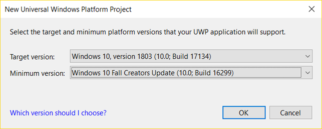

# Creating the UWP project

Create a new UWP project called `MvvmCrossDemo.Uwp` into the solution.

Probably, the default Target version is 1803\(Build 17134\), and make sure the Min version is Fall Creators Update \(Build 16299\) or higher. Because the lastest `MvvmCross` framework does not support the old version of Windows 10.

Install the `MvvmCross` package to the project through the NuGet Package Manager or the console. Like the Android project, add the reference to the `MvvmCrossDemo.Core` project. Then delete the `MainPage.xaml` and the `MainPage.xaml.cs`. We do not need them.

